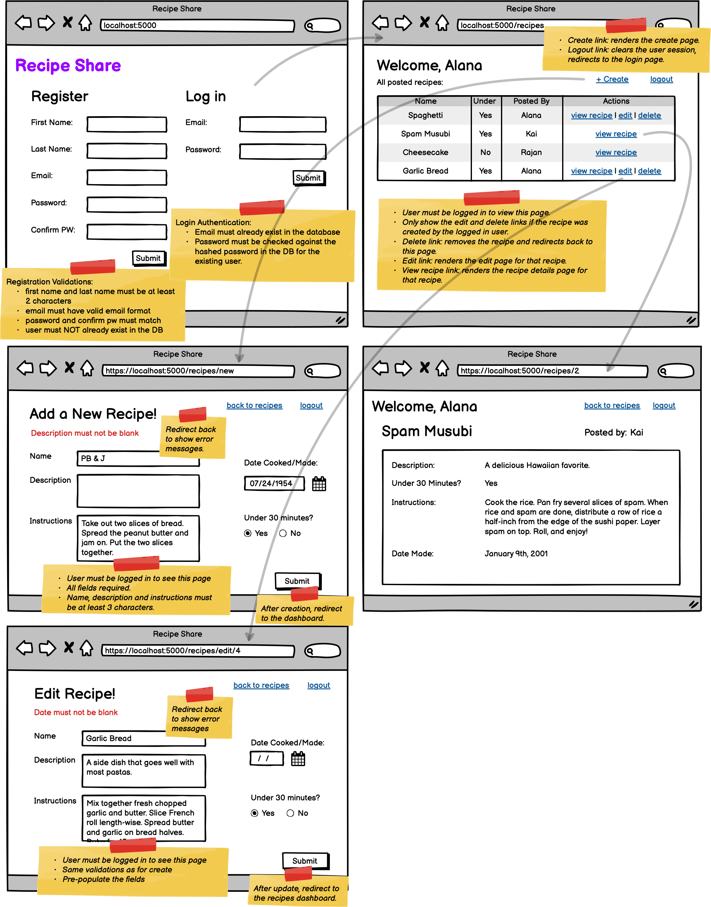

# Recetas

Preparación para el examen de cinturón.

Puedes revisar la asignación [aquí](https://login.codingdojo.com/m/351/11271/77294).

## Requerimientos
Para instalar los requerimientos del proyecto, ejecuta el siguiente comando:

```bash
pip install -r requirements.txt
```

- [Flask==3.0.3](https://pypi.org/project/Flask/3.0.3/)
- [MyMySQL==1.1.1](https://pypi.org/project/PyMySQL/1.1.1/)
- [python-dotenv==1.0.1](https://pypi.org/project/python-dotenv/1.0.1/) 
- [Flask-Bcrypt==1.0.1](https://pypi.org/project/Flask-Bcrypt/1.0.1/)

## Configuración
Para configurar la aplicación, cambia el nombre del archivo `.env.example` a `.env` y modifica las variables de entorno.

## Diagrama de la base de datos
El diagrama de la base de datos de la aplicación.


## Wireframe
El wireframe de la aplicación.

